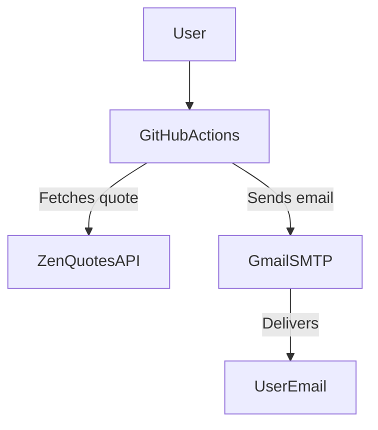

# Daily Inspirational Quote Action

Start each day inspired!  
**Daily Inspirational Quote Action** sends a fresh, motivational quote right to your email using GitHub Actions.


---

## How It Works

This Action:
- Fetches an inspirational quote from [ZenQuotes API](https://zenquotes.io/)
- Sends it to your email inbox using SMTP (Simple Mail Transfer Protocol)



---

## 🚀 Quick Start

### 1. Add the Action to Your Workflow

```yaml
uses: ijayhub/daily-inspirational-quote-action@v1
with:
  recipient: 'email'
```

### 2. Set Up Your Email Secrets

1. Go to **Settings > Secrets and variables > Actions** in your repository.
2. Add these secrets:
   - `EMAIL_USERNAME`: Your Email address (e.g., `youremail@gmail.com`)
   - `EMAIL_PASSWORD`: Your Email App Password ([how to create one](https://support.google.com/accounts/answer/185833?hl=en))
   - `TO_EMAIL`: The recipient's email address

### 3. (Optional) Change the Schedule

- Edit `.github/workflows/daily-quote-action.yml` to adjust when the email is sent.

### 4. Test the Action

- Go to your repo’s **Actions** tab, select "Daily Inspirational Quote", and click **"Run workflow"**.

---

## Inputs

| Name      | Description                              | Required | Default                |
|-----------|------------------------------------------|----------|------------------------|
| recipient | Where to send the quote (e.g., email)    | No       | GitHub Actions log     |

## Outputs

| Name  | Description                        |
|-------|------------------------------------|
| quote | The inspirational quote that posts |

---

## ⚡ Template Instructions

- Click **"Use this template"** on the repository page to quickly start your own version.
- Or fork this repository.

---
ALternative to get stated quickly use: [](https://codespaces.new/ijayhub/daily-quote-action)


> **Note:**  
> You must use your own email and app password in your repository secrets.  
> ⚠️ Never share your app password or email credentials with anyone.

---

## 📖 Learn More

For a detailed breakdown of this project and troubleshooting, visit the [Wiki](https://github.com/ijayhub/daily-quote-action/wiki).

<p align="center">
  <a href="https://github.com/ijayhub/daily-quote-action/wiki" target="_blank">
    
  </a>
</p>

---

## License

[MIT](LICENSE)
