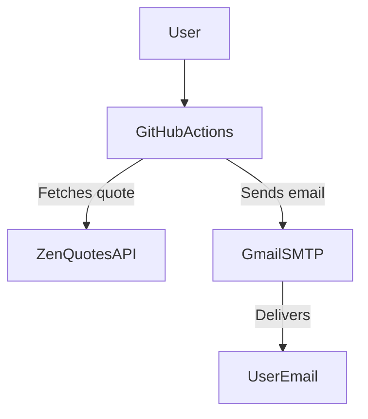

# Daily Inspirational Quote Action

Get a daily inspirational quote sent to your email using GitHub Actions and Gmail!

## Technical Architecture

## 🚀 How to Use This Template

1. **Create your Copy**
   
 - Click the blue or green “Use this template” button above to generate your repository from this template.
  
 - Alternatively, you can fork the repo using GitHub’s Fork button.

2. **Add Your Email Secrets:**
   
 - Go to your new repo’s **Settings > Secrets and variables > Actions**.
     
 - Add the following secrets:
     - `EMAIL_USERNAME`: your Gmail address (e.g. youremail@gmail.com)
     - `EMAIL_PASSWORD`: your Gmail App Password ([how to create one](https://support.google.com/accounts/answer/185833?hl=en))
     - `TO_EMAIL`: the email address to receive the quotes

4. **(Optional) Change the Schedule:**
 - Edit `.github/workflows/daily-quote-action.yml` to change when the email is sent.

5. **Test It:**
 - Go to the **Actions** tab in your new repo.
 - Select "Daily Inspirational Quote" and click **"Run workflow"**.

---

    <strong>👉 For a detailed breakdown of this project, check out the Wiki at the top of the repository.</strong>

  

---

> Each user must use their own Gmail/App Password in their repo secrets.

 ⚠️ **Warning: Never share your App Password or email credentials.**
